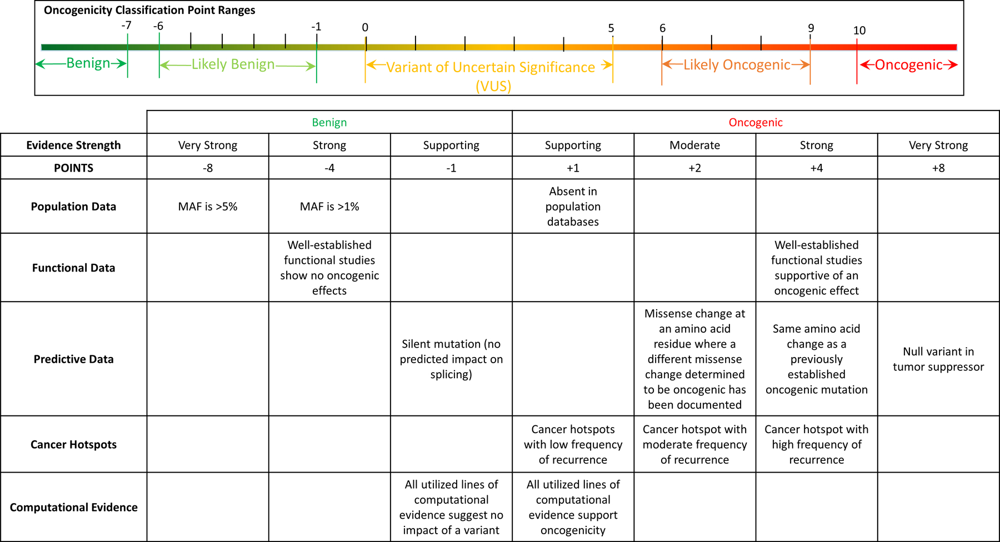

<head>
  <style>
    table.custom-table {
    font-size: 10px;
    }
    table {
      font-size: 16px;
    }
    th, td {
     font-size: 15px;
    }
  
  .main-container {
    max-width: 940px;
    margin-left: 0;
    margin-right: auto;
      }
  </style>
</head>
```{r setup, include=FALSE}

knitr::opts_chunk$set(echo = FALSE, message = FALSE, include = TRUE, warning = FALSE)

DT_default = function(inputtable){
  dto = DT::datatable(inputtable,rownames = FALSE, escape = FALSE, options = list(lengthMenu = list(c(25, 100, -1), c('25', '100', 'All')),
  pageLength = -1))
  return(dto)
}

# Load libs and data
suppressPackageStartupMessages({
library(knitr)
library(janitor)
library(formattable)
library(VariantReport)
library(fontawesome)
library(ggplot2)
})
theme_set(theme_light())
#annotation_fp = VariantAnnotationModules::annotation_filepaths('example_output')
#parsed_fp = VCFparse::parsed_filepaths('example_output')
parsed_fp = params$parsed_fp
annotation_fp = params$annotation_fp
sampleName = params$sample_ID
vcf_info = params$vcf_info

modules= '/home/ionadmin/github_app/genie/Modules/'
```

# Analysis Name: `r sampleName`  {.tabset}

```{r, include=FALSE}
snv = readr::read_tsv(parsed_fp$parsed_snv)
complete = readr::read_tsv(parsed_fp$parsed_complete)
snv = VariantAnnotationModules::amino_acid_code_3_to_1(snv)
clinvar_hits = readr::read_tsv(annotation_fp$clinvar)
snv$AF = round(snv$AF, digits = 2)
```

## Sample Metadata {.tabset}
```{r, include=FALSE, child='/home/ionadmin/github_app/genie/Modules/sample_metadata.Rmd')}

```


<!-- next main tab -->

## Variant Calling {.tabset }

### Quality Control

```{r, child='/home/ionadmin/github_app/genie/Modules/QC.Rmd'}


```


### Strand ratios
* FSAF: Flow evaluator Allele forward reads
* FSAR: Flow evaluator Allele reverse reads
* FSRF: Flow evaluator Reference forward reads
* FSRR: Flow evaluator Reference reverse reads

```{r, include=FALSE}
strand_ratios = VariantReport::add_strand_ratios(snv)
strand_ratios = dplyr::select(strand_ratios, rowid, gene, abs_delta, contains("ratio", ignore.case = FALSE),contains("FS"))
```

```{r}
DT_default(strand_ratios)
```


```{r, eval=FALSE}
library(ggplot2)
strand_ratios = dplyr::mutate(strand_ratios, 
                              sum_Allele = FSAF+FSAR,
                              sum_Ref = FSRF+FSRR,
                              coverage = FSAF+FSAR+FSRF+FSRR,
                              type = 'sequencing')

snv |>
  dplyr::filter(rowid == 1112) |>
  dplyr::select(rowid, gene,AF, contains("Depth"),contains("FS"))


norm_ratio_tb = tibble::tibble(log2_read_ratio_Ref = rnorm(100, mean =0, sd = 1),
                               log2_read_ratio_Alt = log2_read_ratio_Ref+rnorm(100, mean =0, sd = 0.1),
                               coverage = 10,
                               abs_delta = rnorm(100, mean = 0 , sd = 0.5),
                               type = 'synthetic')

plottable = dplyr::bind_rows(strand_ratios, norm_ratio_tb)

gg_plot = ggplot(plottable, aes(x = log2_read_ratio_Ref, y = log2_read_ratio_Alt, 
                                label = gene, label2 = FSAF,label3 = FSAR, label4=FSRF, label5=FSRR))
library(plotly)
gg_plot = gg_plot + geom_point(aes(size = log10(coverage), col = type), alpha = .8) +  geom_abline(intercept = 0, slope = 1) 
ggplotly(gg_plot)

```


<!-- next main tab -->

## Interpretation {.tabset}

### Scores

```{r, eval=FALSE}
sel_snv$metric_value = ifelse(sel_snv$QUAL > 10 & abs(sel_snv$read_ratio_Allele) > 1 &abs(sel_snv$read_ratio_Allele) <3, "B_warning",
                    ifelse(sel_snv$QUAL > 10 &
                             abs(sel_snv$read_ratio_Allele) <3 &
                             abs(sel_snv$read_ratio_Ref) < 3, "A_pass","C_fail"))
```




* cH = cancerHotspot 
```{r, eval=TRUE}
datadisply = VariantReport::add_interpretation_columns(snv)
datadisply = dplyr::rename(datadisply, cH_pos_count = cancerHotspot_position_count,
                                       cH_variant_count = cancerHotspot_variant_count)
datadisply = dplyr::relocate(datadisply, gnomad_MAF, .after = "Horak_classification")

if(!is.na(all(datadisply$gnomad_MAF))){
  datadisply$gnomad_MAF = formatC(datadisply$gnomad_MAF, format = "e", digits = 1)
}
```


```{r, eval=TRUE}
DT_default(datadisply)
```


### COSMIC Variant-Tissue Heatmap
```{r, include=FALSE}
cosmic_heat = readr::read_tsv(annotation_fp$COSMIC)
cosmic_heat = dplyr::select(cosmic_heat, gene, coding, protein, COSMIC_n_tissue)

#cosmic_heat$tissue = stringr::str_remove_all(cosmic_heat$COSMIC_n_tissue, " \\(\\d+\\)| ")
cosmic_heat$tissue = stringr::str_split(cosmic_heat$COSMIC_n_tissue, pattern = ";")
cosmic_heat = tidyr::unnest(cosmic_heat,cols = tissue)
cosmic_heat = dplyr::filter(cosmic_heat, !is.na(tissue))
cosmic_heat = tidyr::separate(cosmic_heat,col = 'tissue', into = c('tissue','No'), sep = " \\(")
cosmic_heat = dplyr::mutate(cosmic_heat, No = gsub("\\)",'', No), No = as.numeric(No))

#cosmic_heat$tissue = stringr::str_remove_all(cosmic_heat$tissue, pattern = " ")

cosmic_heat = dplyr::select(cosmic_heat,  gene, coding, protein, tissue, No) 
cosmic_heat = dplyr::mutate(cosmic_heat, uid = paste(gene,coding, protein, sep = "_"))

gg_plot = ggplot(cosmic_heat, aes(x = forcats::fct_reorder(tissue, -No), y=forcats::fct_reorder(uid, No))) + 
  geom_point(aes(size = No)) +
  theme(axis.text.x = element_text(color = "black", size = 15, angle = 60, hjust = 1),
        axis.text.y = element_text(color = "black", size = 15, angle = 0, hjust = 1)) +
  labs(x = '',
       y ='')

```

Plot displaying only variants with any tissue hit in COSMIC database. Size of point indicates observed number of entries per tissue.

```{r, fig.width = 15, fig.height=12, fig.align = "center"}
gg_plot
```


```{r, eval=FALSE}
### Testing
# m = matrix(
#   classval, nrow = length(VARIANTS), ncol = 3, byrow = TRUE,
#   dimnames = list(VARIANTS, classifications)
# )
# for (i in seq_len(nrow(m))) {
#   m[i, ] = sprintf(
#     '<input type="radio" name="%s" value="%s"/>',
#     VARIANTS[i], m[i, ]
#   )
# }
#     


sel_snv = display_std_metrics(snv)
sel_snv$selection ="<input type='radio' name='row1' value='report'> Report<input type='radio' name='row1' value='artefact'> Artefact<input type='radio' name='row1' value='do-not-report'> Do Not Report'"

DT::datatable(sel_snv, rownames = FALSE, escape = FALSE, callback = JS("table.rows().every(function(i, tab, row)"))

```

<!-- next main tab -->

## CNV {.tabset}
```{r}
source("")

```


<!-- next main tab -->
## Gene Annotation modules {.tabset}
### MP Variant Interpretations
```{r}
if(file.exists(mpv_filepath)){
  mpvs = readr::read_tsv(mpv_filepath)
  DT::datatable(mpvs)
}else{
  print("No MP Variant Interpretation table entries")
}
```

<!-- next main tab -->


### BRAF Variant Class
```{r}
if(file.exists(braf_class)){
  braf_class = readr::read_tsv(braf_class)
  DT::datatable(braf_class)
}else{
  print("No BRAF variant entries")
}
```
